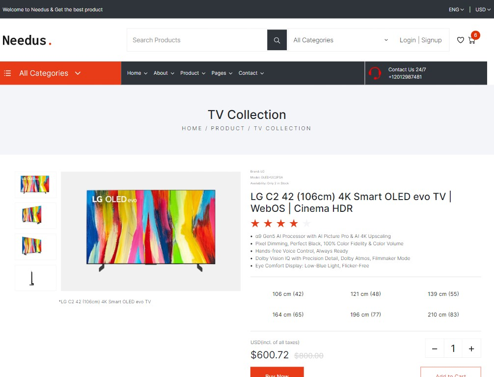

# Pug Templating
This is an example how to create a perfect html design by using Pug, Gulp and Bootstrap.

## Setup
Enter de `frontend` directory
Run ``npm run install``
After all the dependencies are installed, run ``npm run start`` to start the project

## Output

All the changes done in the frontend will be compiled and stored in site/www_mk